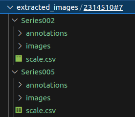
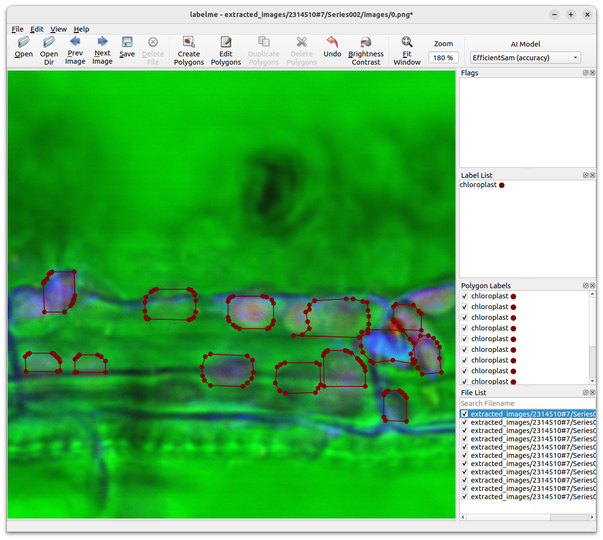

# Chloro-count

This repository contains code for segmenting, counting and measuring chloroplasts and bundle sheath cells as described in:

> Increased Chloroplasts Occupancy in Bundle Sheath Cells of Rice hap3H Mutants Revealed by Chloro-count, a New Deep Learning-based Tool.
>
> -- <cite>Lambre-Frotte, et al.</cite>


## Software dependencies

`Chloro-count` relies on several python packages to run. 

You can meet all dependencies, possibly within a python virtual environment, by running the following command.

```console
pip3 install -r requirements.txt
```

## Download pre-trained models 

Our pre-trained PyTorch models for both chloroplast and bundle sheath cell segmentation are available for download [here](https://drive.google.com/drive/folders/1cQYHMO8vtva6Zk5fhSyqX7xqHaK0lq6Q?usp=sharing).

Make sure you save both models under the `models` folder. 


### (Optional) Using the .lif demo file

Throughout this tutorial, we will be using the `.lif` file available [here](https://drive.google.com/drive/folders/1tpx0Vc3ej3YkjqpY5XNrVS1qMhvH8-bQ?usp=sharing). However, feel free to proceed using your own data.

> **_NOTE:_** Chloro-count models were trained using LIF files having the following characteristics: 
> - Channel 0:
> - Channel 1:
> - Channel 2:
> Make sure to adapt the your code accordingly. 

## Run segmentation

Use the command below to generate the initial segmentations for either *chloroplasts* or *bundle sheath cells*.

```console
python segment.py --lif_dir LIF_DIR --output_dir OUTPUT_DIR --path_to_model PATH_TO_MODEL
``` 

where: 
```
LIF_DIR is the path to directory containing all LIF files.
OUTPUT_DIR is the directory where images and segmentations will created.
DIR_MODELS is the directory containing both models used for segmentation (chloroplasts and bundle sheath cell). Notice that the name of the model will define the segments' labels.
```
You also have the option of append the `--skip_image_extraction` flag to skip the image extraction step and just regenerate segmentations. This is useful when you just want to try another segmentation model

You can also run `python segment.py --help ` to see the help menu.


### Folder Structure
The above command will create folders with the following structure `extracted_cells/{lif_file}/{cell_id}/`. In our example, we have:

<p align="center">
  
</p>

- **{lif_file} (e.g. 2314510#7):** Folder containing all cells segmented from file `2314510#7.lif`. 
- **{cell_id} (e.g. Series002, Series005,...):** Folders containing segments for cells identified as `Series002` and `Series005`. 
- **annotations:** Folder containing segmentation annotation in json format. One for each slice.
- **images:** Folder containing original images extracted from lif files. One for each slice.


## Manual Adjustment

The previous steps will have generate the segmentations for both *bundle sheath cells* and *chloroplasts*.
Use [LabelMe](https://github.com/labelmeai/labelme), already installed as one of the project's dependencies, to adjust correct imperfect annotations.

```shell
labelme extracted_images/2314510\#7/Series002/images -O extracted_images/2314510\#7/Series002/annotations
```


<p align="center">
  
</p>


## Extract metrics

Once all segments have been validated, run the following command to generate the measure the volume of each chloroplast and bundle sheath cell. The command will generate one `.csv`file per cell.


